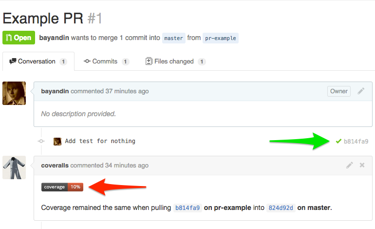

# Домашнее задание №1

## Окружение для разработки

В целях унификации окружения для разработки под различных OS предлагается использовать [Vagrant](http://www.vagrantup.com/).

### Зависимости

Следующие программы необходимо скачать и установить:

- [Git](http://git-scm.com/downloads)
- [VirtualBox](https://www.virtualbox.org/wiki/Downloads)
- [Vagrant](http://www.vagrantup.com/downloads.html)

Ещё понадобится аккаунт на [GitHub](https://github.com/).

### Развёртывание и настройка окружения

Сначала нужно сделать форк проекта, о том как это можно сделать описано [здесь](https://help.github.com/articles/fork-a-repo),
после этого:

```bash
git clone https://github.com/${USER}/tech-testing-ha1.git # где ${USER} — имя вашего пользователя на GitHub
cd tech-testing-ha1
vagrant up # Запуск Vagrant и подготовка виртуальной машины (с Ubuntu 12.04)
vagrant ssh # Получить доступ по ssh к виртуальной машине. После этого все команды будут выполняться в виртаульной машине
```

[Документация на Vagrant](http://docs.vagrantup.com/v2/)

### Структура проекта

- [`./provision/`](provision/) — скрипт для установки зависимостей и конфигурационные файлы
- [`./source/`](source/) — код тестируемых приложений
- [`./source/config/`](source/config) — примеры конфигурационных файлов для приложений
- [`./source/tests/`](source/tests) — директория c тестами
- [`./run_tests.py`](run_tests.py) — скрипт для запуска тестов
- [`./.coveragerc`](.coveragerc) — конфигурация сборки покрытия

## Разработка

Примеры команд указаны относительно корня проекта.

- Тесты должны находиться в директории [`./tests/`](source/tests), можно добавлять тесты к уже существующим
в файлы [`test_notification_pusher.py`](source/tests/test_notification_pusher.py) и [`test_redirect_checker.py`](source/tests/test_redirect_checker.py)
    - При создании новых файлов/классов с тестами нужно указать их в скрипте запуска тестов: `./run_tests.py`
- Запустить все тесты: `./run_tests.py`
- Запустить тесты и измерить покрытие: `coverage run ./run_tests.py`
- Получить информацию о покрытии:
    - В консоли: `coverage report`
    - Создать отчёт в формате html: `coverage html`. По умолчанию будет создана директория `htmlcov`,
    чтобы просмотреть отчёт нужно в браузере открыть файл `htmlcov/index.html`
- Запустить один тест:
```bash
export PYTHONPATH=$PYTHONPATH:./source # добавление пути до директории source в PYTHONPATH
python -m unittest source.tests.test_notification_pusher.NotificationPusherTestCase.test_create_pidfile_example
```

## Pull Requests (PR)

Пример PR:

[](https://github.com/bayandin/tech-testing-ha1/pull/1)

На нём зелёная стрелка указывает на сборку на [Travis CI](https://travis-ci.org/bayandin/tech-testing-ha1/builds/36225422),
а красная на анализ покрытия (по строкам) для сборки на [Coveralls](https://coveralls.io/builds/1254508).

[Статья о PR](https://help.github.com/articles/using-pull-requests)
